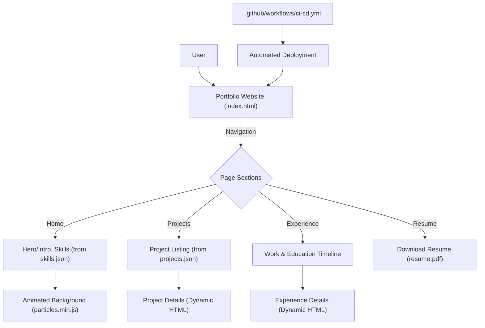

# 🚀 Jiya's Dynamic Portfolio Website

<p align="center"></p>

<p align="center">
  <a href="https://github.com/jiya1248/jiyaportfolio_website/stargazers"></a>
  <a href="https://github.com/jiya1248/jiyaportfolio_website/network/members"></a>
  <a href="https://github.com/jiya1248/jiyaportfolio_website/issues"></a>
  <a href="./LICENSE"></a>
</p>

## Short Description
This repository hosts Jiya's professional, dynamic, and responsive portfolio website. It's meticulously crafted to showcase skills, experience, and a diverse range of projects, providing a comprehensive overview of Jiya's technical capabilities and career journey. Designed for impact and ease of navigation, this portfolio is the gateway to understanding Jiya's contributions in the tech landscape.

## ✨ Key Features
*   **Comprehensive Showcase**: Dedicated sections for "Projects" and "Experience" to highlight diverse work and career milestones.
*   **Dynamic Content Loading**: Utilizes JSON files (`projects.json`, `skills.json`) for easily manageable and updatable content, enabling a seamless content delivery experience.
*   **Interactive UI/UX**: Enhanced with modern CSS and JavaScript, including libraries like `particles.min.js` for engaging visual effects.
*   **Responsive Design**: Optimized for a flawless viewing experience across all devices, from desktops to mobile phones.
*   **Automated Deployment**: Integrated with GitHub Actions for Continuous Integration and Continuous Deployment (CI/CD), ensuring the site is always up-to-date and reliably deployed.
*   **Direct Resume Access**: Features an easily accessible and downloadable resume (`resume.pdf`) for potential employers and collaborators.
*   **Custom 404 Page**: A branded and user-friendly error page (`404.html`) to guide users back to relevant content.

## Who is this for?
This portfolio is primarily designed for:
*   **Recruiters & Hiring Managers**: To quickly assess Jiya's skills, experience, and project work.
*   **Potential Collaborators**: To explore Jiya's expertise and identify opportunities for teamwork.
*   **The Developer (Jiya)**: To maintain a professional online presence and easily update career highlights.
*   **Anyone interested in Modern Web Development**: To observe a well-structured, static site deployment with CI/CD.

## Technology Stack & Architecture
This project leverages a robust and modern client-side technology stack, optimized for performance and maintainability:

*   **Frontend**: Pure HTML5, CSS3, and JavaScript for a blazing-fast, interactive user interface.
*   **Styling**: Custom CSS (`style.css`, `404.css`, etc.) for unique aesthetics and responsive design.
*   **Interactivity**: Vanilla JavaScript (`app.js`, `script.js`) combined with `particles.min.js` for dynamic visual elements.
*   **Content Management**: JSON files (`projects.json`, `skills.json`) serve as lightweight data sources for dynamic content sections.
*   **Build/Deployment**: GitHub Actions for CI/CD, automating testing and deployment to platforms like GitHub Pages.
*   **Development Environment**: Configured with `.vscode` settings for consistent development practices.

## 📊 Architecture & Database Schema
This is a static, client-side application, so there's no traditional database schema. Instead, content is driven by local JSON files. The architecture focuses on content presentation and user flow:



## ⚡ Quick Start Guide
To get a local copy of this portfolio website up and running:

1.  **Clone the Repository**:
    ```bash
    git clone https://github.com/jiya1248/jiyaportfolio_website.git
    cd jiyaportfolio_website
    ```
2.  **Open in Browser**:
    Simply open the `index.html` file in your preferred web browser. All assets (CSS, JS, images, JSON data) are loaded locally.

## 📜 License
This project is licensed under the [MIT License](LICENSE).